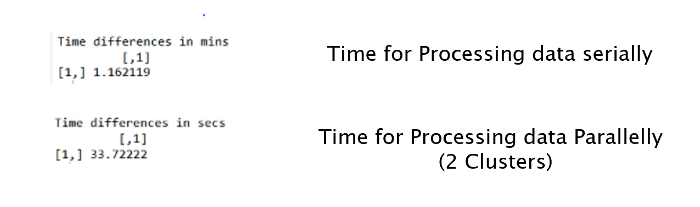
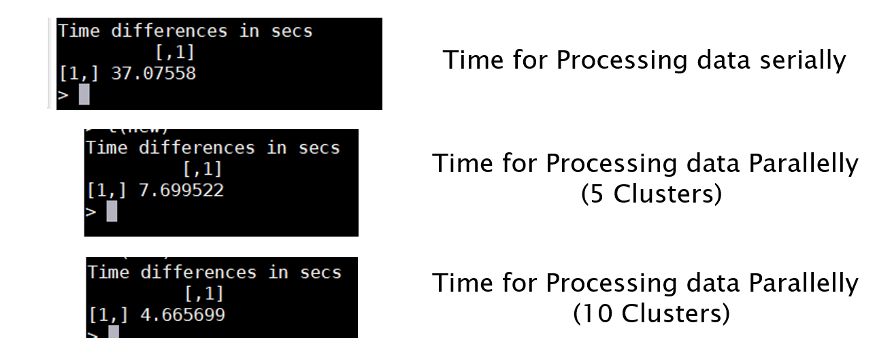

# Comparing-AWS-and-Compute-Canada-Cloud
Comparing The Time Taken to Process a Data Serially and Parallaly in 2 Different Cloud Platform
# <h1> FOR AMAZON WEB SERVICES  

# <h1> FOR COMPUTE CANADA CLOUD

